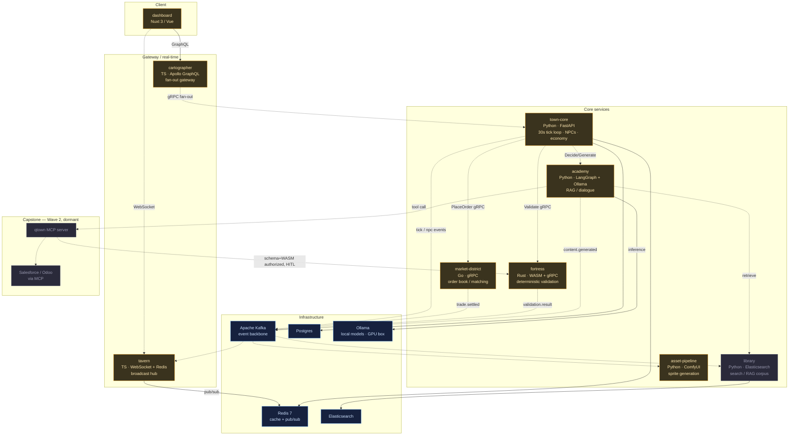
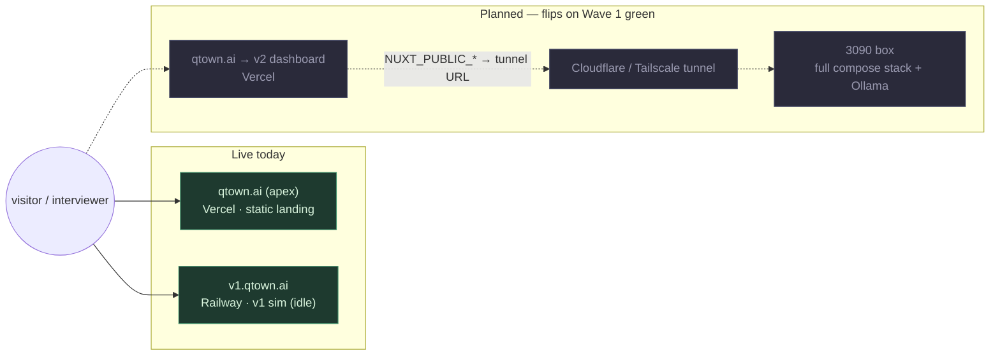
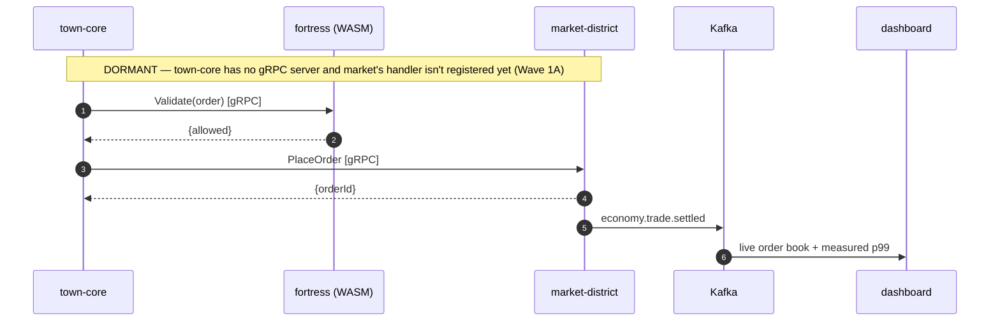
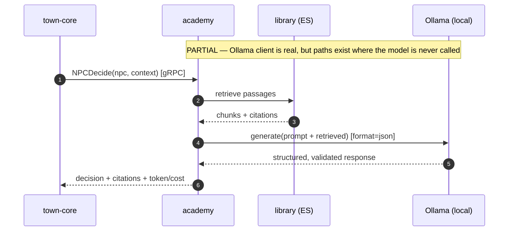

# Qtown v2 — Architecture of Record

> **Status:** Draft 1, 2026-07-12. This is the **honest** system self-portrait. Node colours track
> `docs/STATE.md` — 🟢 green (works e2e), 🟡 partial (real logic, not wired e2e), ⚫ dormant (stub).
> Mermaid renders natively on GitHub. This file is the source of truth; the in-app
> `dashboard/pages/docs/architecture.vue` and the **Planning Office** area render from the same
> reality. **As of 2026-07-12 no flow is green** — the diagrams say so on purpose.

## Status legend

```
🟢 green    wired end-to-end + e2e CI gate + real proof data (all 6 of REQUIREMENTS.md §3.1)
🟡 partial  real logic exists, but no end-to-end flow / no gate — ships dormant in-app
⚫ dormant   stub / scaffold / not started — visibly labeled, never faking activity
```

## System / container view

Every edge here is a *contract that is supposed to exist*. Solid = implemented and exercised;
dashed = planned or one-sided today. The colours are the current truth, not the aspiration.



## Deployment view

Frontend on the edge, GPU-backed backend on owned hardware behind a tunnel, v1 preserved on its own
subdomain. This is the "local box exposed" option from `REQUIREMENTS.md §10`.



## Flagship flow — Market Trade *(⚫ dormant: 0/3 e2e flows work; shown as the target)*



## Flagship flow — AI Dialogue / RAG *(🟡 partial: model call is a facade on some paths — Wave 0 W0-2 / Wave 1B)*



## Corrections this file makes to the old in-app diagram

The previous `architecture.vue` asserted three things that were false (now being fixed):

| Claim in old diagram | Truth |
|---|---|
| `fortress` is **Go** | `fortress` is **Rust / WASM** (+ gRPC). |
| tick loop runs **~500ms** | tick loop runs every **30s**. |
| NPC decisions via **GPT-4o-mini** | decisions route to **local Ollama** models (≥90% local; `REQUIREMENTS.md §6`). |
| all 9 services fully wired | **0/3 flagship flows work** end-to-end (`docs/STATE.md`). |
