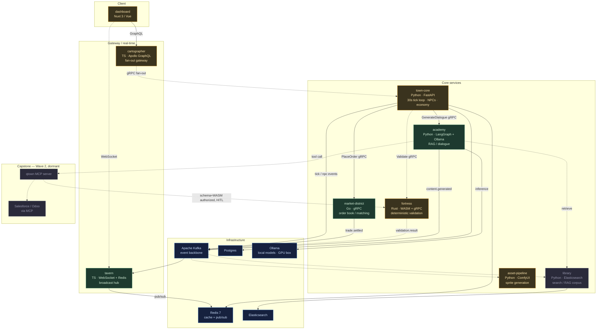
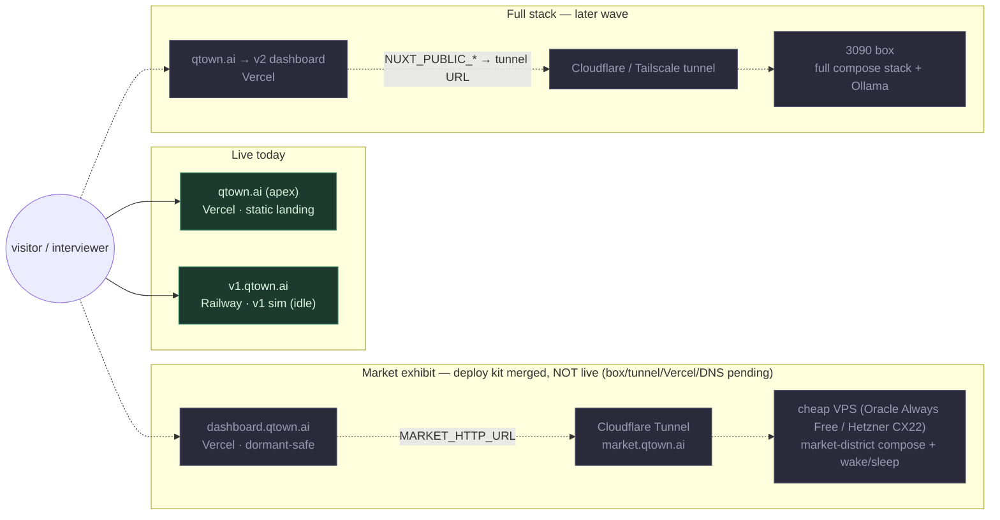
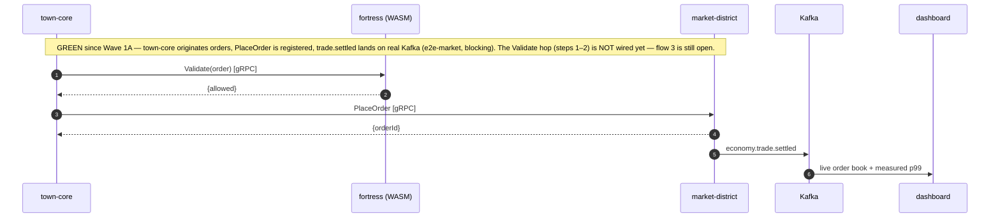

# Qtown v2 — Architecture of Record

> **Status:** Draft 2, 2026-08-23. This is the **honest** system self-portrait. Node colours track
> `docs/STATE.md` — 🟢 green (works e2e), 🟡 partial (real logic, not wired e2e), ⚫ dormant (stub).
> Mermaid renders natively on GitHub. This file is the source of truth; the in-app
> `dashboard/pages/docs/architecture.vue` and the **Planning Office** area render from the same
> reality. **As of 2026-08-23, flows 1 (market trade) and 2 (dialogue + RAG grounding) run
> end-to-end behind blocking CI gates; flow 3 (validation) is still open** — the diagrams say
> exactly that, no more.

## Status legend

```
🟢 green    wired end-to-end + e2e CI gate + real proof data (all 6 of REQUIREMENTS.md §3.1)
🟡 partial  real logic exists, but no end-to-end flow / no gate — ships dormant in-app
⚫ dormant   stub / scaffold / not started — visibly labeled, never faking activity
```

## System / container view

Every edge here is a *contract that is supposed to exist*. Solid = implemented and exercised;
dashed = planned or one-sided today. The colours are the current truth, not the aspiration.


```mermaid
flowchart TB
  classDef green   fill:#1e3a2f,stroke:#40916c,color:#d8f3dc;
  classDef partial fill:#3a331e,stroke:#f5a623,color:#ffe8b3;
  classDef dormant fill:#2a2a3a,stroke:#4a4e69,color:#9a9ab0;
  classDef infra   fill:#16213e,stroke:#60a5fa,color:#cfe3ff;

  subgraph CLIENT[Client]
    dashboard["dashboard<br/>Nuxt 3 / Vue"]:::partial
  end

  subgraph EDGE[Gateway / real-time]
    cartographer["cartographer<br/>TS · Apollo GraphQL<br/>fan-out gateway"]:::partial
    tavern["tavern<br/>TS · WebSocket + Redis<br/>broadcast hub"]:::green
  end

  subgraph CORE[Core services]
    towncore["town-core<br/>Python · FastAPI<br/>30s tick loop · NPCs · economy"]:::partial
    market["market-district<br/>Go · gRPC<br/>order book / matching"]:::green
    fortress["fortress<br/>Rust · WASM + gRPC<br/>deterministic validation"]:::partial
    academy["academy<br/>Python · LangGraph + Ollama<br/>RAG / dialogue"]:::green
    library["library<br/>Python · Elasticsearch<br/>search / RAG corpus"]:::dormant
    assets["asset-pipeline<br/>Python · ComfyUI<br/>sprite generation"]:::partial
  end

  subgraph INFRA[Infrastructure]
    kafka["Apache Kafka<br/>event backbone"]:::infra
    redis["Redis 7<br/>cache + pub/sub"]:::infra
    pg["Postgres"]:::infra
    es["Elasticsearch"]:::infra
    ollama["Ollama<br/>local models · GPU box"]:::infra
  end

  subgraph EXT[Capstone — Wave 2, dormant]
    mcp["qtown MCP server"]:::dormant
    saas["Salesforce / Odoo<br/>via MCP"]:::dormant
  end

  %% client edges
  dashboard -->|GraphQL| cartographer
  dashboard -.->|WebSocket| tavern

  %% gateway edges
  cartographer -.->|gRPC fan-out| towncore
  tavern -->|pub/sub| redis

  %% core synchronous contracts (solid = wired and exercised e2e; dashed = planned / one-sided)
  towncore -->|PlaceOrder gRPC| market
  towncore -.->|Validate gRPC| fortress
  towncore -->|GenerateDialogue gRPC| academy
  academy -->|inference| ollama
  academy -.->|retrieve| library
  library --> es

  %% event backbone
  towncore -->|tick / npc events| kafka
  market -->|trade.settled| kafka
  fortress -.->|validation.result| kafka
  academy -->|content.generated| kafka
  kafka --> tavern
  kafka -.-> library
  kafka -.-> assets
  towncore --> redis
  towncore --> pg

  %% capstone
  academy -.->|tool call| mcp
  mcp -.->|schema+WASM authorized, HITL| fortress
  mcp -.-> saas
```

## Deployment view

v1 preserved on its own subdomain; the v2 backend is **not hosted anywhere yet**. The first v2
go-live is the **market exhibit** model (deploy kit merged, PR #4 — runbooks in
`deploy/market-exhibit/` and `deploy/dashboard/`): market-district on a free/cheap box behind a
Cloudflare Tunnel, dashboard on Vercel pointed at it, ~$0–4/mo, wake/sleep scripts so *asleep is
honest, not broken*. The full compose stack on the 3090 box stays the later, larger step. Every
node below except the two "Live today" ones is **planned — pending manual go-live steps**.


```mermaid
flowchart LR
  classDef live    fill:#1e3a2f,stroke:#40916c,color:#d8f3dc;
  classDef planned fill:#2a2a3a,stroke:#4a4e69,color:#9a9ab0;

  user(("visitor / interviewer"))

  subgraph now[Live today]
    apex["qtown.ai (apex)<br/>Vercel · static landing"]:::live
    v1["v1.qtown.ai<br/>Railway · v1 sim (idle)"]:::live
  end

  subgraph exhibit["Market exhibit — deploy kit merged, NOT live (box/tunnel/Vercel/DNS pending)"]
    mdash["dashboard.qtown.ai<br/>Vercel · dormant-safe"]:::planned
    mtunnel["Cloudflare Tunnel<br/>market.qtown.ai"]:::planned
    mbox["cheap VPS (Oracle Always Free / Hetzner CX22)<br/>market-district compose + wake/sleep"]:::planned
  end

  subgraph planned_["Full stack — later wave"]
    vdash["qtown.ai → v2 dashboard<br/>Vercel"]:::planned
    tunnel["Cloudflare / Tailscale tunnel"]:::planned
    box["3090 box<br/>full compose stack + Ollama"]:::planned
  end

  user --> apex
  user --> v1
  user -.-> mdash
  mdash -.->|MARKET_HTTP_URL| mtunnel
  mtunnel -.-> mbox
  user -.-> vdash
  vdash -.->|NUXT_PUBLIC_* → tunnel URL| tunnel
  tunnel -.-> box
```

## Flagship flow — Market Trade *(🟢 green: runs e2e behind the blocking `e2e-market` gate; the fortress Validate hop is still the target, not wired)*


```mermaid
sequenceDiagram
  autonumber
  participant TC as town-core
  participant FT as fortress (WASM)
  participant MK as market-district
  participant KF as Kafka
  participant DB as dashboard
  Note over TC,MK: GREEN since Wave 1A — town-core originates orders, PlaceOrder is registered, trade.settled lands on real Kafka (e2e-market, blocking). The Validate hop (steps 1–2) is NOT wired yet — flow 3 is still open.
  TC->>FT: Validate(order) [gRPC]
  FT-->>TC: {allowed}
  TC->>MK: PlaceOrder [gRPC]
  MK-->>TC: {orderId}
  MK->>KF: economy.trade.settled
  KF->>DB: live order book + measured p99
```

## Flagship flow — AI Dialogue / RAG *(🟢 green: tick-triggered dialogue, RAG-grounded on town events; blocking `eval-academy` recall gates)*

```mermaid
sequenceDiagram
  autonumber
  participant TC as town-core
  participant AC as academy
  participant VS as pgvector (academy.embeddings)
  participant OL as Ollama (local)
  Note over AC,OL: GREEN since Wave 1B — the W0-2 facade is fixed; retrieval runs against academy's pgvector store (docs + town events). The library (ES) RAG client remains unbuilt — tracked, not faked.
  TC->>AC: GenerateDialogue(pair, context) [gRPC]
  AC->>VS: retrieve passages (docs + events)
  VS-->>AC: chunks + citations
  AC->>OL: generate(prompt + retrieved) [format=json]
  OL-->>AC: structured, validated response
  AC-->>TC: dialogue + grounded_events + token/cost
```

## Corrections this file makes to the old in-app diagram

The previous `architecture.vue` asserted three things that were false (now being fixed):

| Claim in old diagram | Truth |
|---|---|
| `fortress` is **Go** | `fortress` is **Rust / WASM** (+ gRPC). |
| tick loop runs **~500ms** | tick loop runs every **30s**. |
| NPC decisions via **GPT-4o-mini** | decisions route to **local Ollama** models (≥90% local; `REQUIREMENTS.md §6`). |
| all 9 services fully wired | **2/3 flagship flows run e2e** behind blocking gates; validation (flow 3) is still open and cartographer's gRPC federation is a stub (`docs/STATE.md`). |
